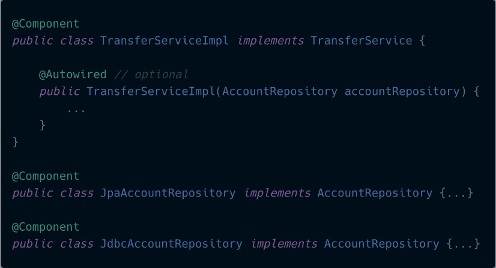
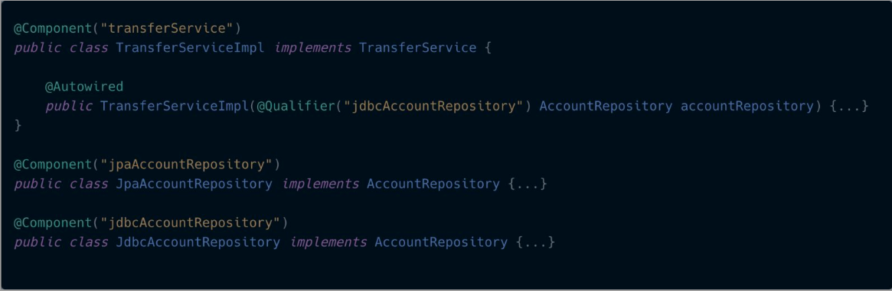

# 🛠 🚀 Spring Certification 🚀 🛠 
Exercises for Spring Certified Professional

## ✅ Spring AOP ✅
Here is an example of applying AOP.

##### Join Point
A point in the execution of a program like a method call or exception thrown

##### Pointcut
The expression that selects the Join Point 

For selecting where to apply the advice

##### Advice
The code to be executed

##### Aspect
The encapsulation of the Pointcut & Advice. The What and the Where.

##### Weaving
The technique where the aspect and the target are merged

##### Proxy
When someone stands in place of someone else

##### Spring Proxy
When an enhanced class stands in place of your original

#### Flow

```log
1. Spring creates a Proxy, weaving aspect & target

2. Proxy implements target interface

3. All calls are routed to Proxy interceptor

4. Matching advice is executed

5. If there are no exceptions thrown, target method is executed
```

## ✅ Spring NoUniqueBeanDefinitionException ✅
In the Spring Framework Essentials Course at Broadcom Spring Academy

[Spring Academy](https://spring.academy/)

We have the following example:




Which one should get injected?

At startup:

```log
NoSuchBeanDefinitionException,
no unique bean of type [AccountRepository] is defined:
expected single bean but found 2...
```

But the above error is wrong, what we really get is:

```log
Exception in thread "main" org.springframework.beans.factory.UnsatisfiedDependencyException: 
Error creating bean with name 'transferServiceImpl' defined in file 
[/Users/rac/RAC/GitHub/spring-certification/spring-no-unique-bean-definition-exception/target/classes/rafael/alcocer/caldera/spring/service/TransferServiceImpl.class]: 
Unsatisfied dependency expressed through constructor parameter 0; 
nested exception is org.springframework.beans.factory.NoUniqueBeanDefinitionException: 
No qualifying bean of type 'rafael.alcocer.caldera.spring.repository.AccountRepository' available: expected single matching bean but found 2: 
jdbcAccountRepository,jpaAccountRepository 
```

SOLUTION:



```java
@Component
public class TransferServiceImpl implements TransferService {

    private final AccountRepository accountRepository;
    
    // SOLUTION
    public TransferServiceImpl(@Qualifier("jdbcAccountRepository") AccountRepository accountRepository) {
        this.accountRepository = accountRepository;
    }
}
```

### NOTE
Adding the names to the @Component is optional because by default Spring takes the name of the class with first letter lower-cased.

This one:

```java
@Component
public class JpaAccountRepository implements AccountRepository {...}
```

Is equivalent to this one:

```java
@Component("jpaAccountRepository")
public class JpaAccountRepository implements AccountRepository {...}
```


